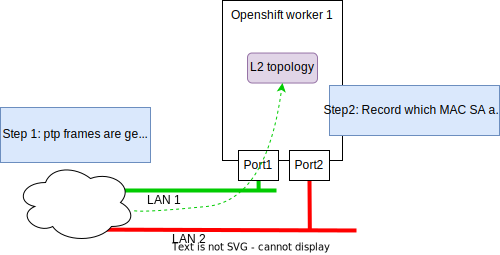

# Host based L2 discovery 
The rapid discovery of L2 hosts is realized by probing the network with test Ethernet frames


Each openshift node reports L2 connectivity with a JSON log as shown below. The Json represent a map ordered by ethertype -> local interface -> remote mac address. So for each local interface it lists the MAC addresses that are received per ethertype. We are using the "experimental" ethertype to generate the probe packets (0x88b5):

```json
{
  "88b5": {
    "eno5np0": {
      "Local": {
        "IfName": "eno5np0",
        "IfMac": {
          "Data": "F4:03:43:D1:70:A0"
        },
        "IfIndex": 2
      },
      "Remote": {
        "F4:03:43:D1:40:F0": true,
        "F4:03:43:D1:65:D0": true
      }
    },
    "eno6np1": {
      "Local": {
        "IfName": "eno6np1",
        "IfMac": {
          "Data": "F4:03:43:D1:70:A8"
        },
        "IfIndex": 4
      },
      "Remote": {
        "48:DF:37:BC:F0:E1": true,
        "48:DF:37:BC:F4:41": true,
        "F4:03:43:D1:40:F8": true,
        "F4:03:43:D1:65:D8": true
      }
    },
    "ens3f0": {
      "Local": {
        "IfName": "ens3f0",
        "IfMac": {
          "Data": "48:DF:37:BC:F1:64"
        },
        "IfIndex": 6
      },
      "Remote": {
        "48:DF:37:BC:F0:E0": true,
        "48:DF:37:BC:F4:40": true
      }
    },
    "ens3f1": {
      "Local": {
        "IfName": "ens3f1",
        "IfMac": {
          "Data": "48:DF:37:BC:F1:65"
        },
        "IfIndex": 8
      },
      "Remote": {
        "48:DF:37:BC:F0:E1": true,
        "48:DF:37:BC:F4:41": true,
        "F4:03:43:D1:40:F8": true,
        "F4:03:43:D1:65:D8": true
      }
    }
  }
}
```


Frames with the ptp Ethertype are also collected, but not transmitted. This helps identify which port are already receiving PTP protocol frames.


